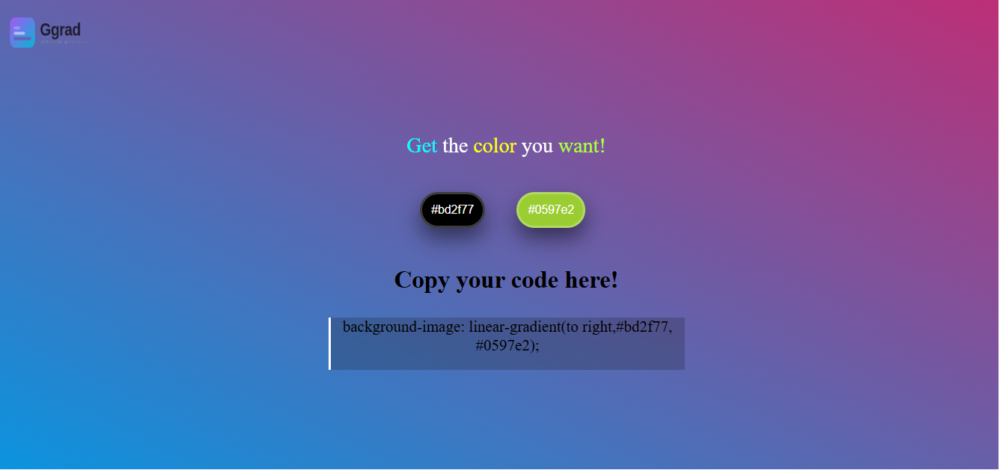

# 🎨 Ggrad — Gradient Generator

A simple browser-based gradient generator that creates beautiful random color gradients with one click and lets you copy the CSS instantly.

---

## ✨ Features

- 🎲 Generate random hex colors for two gradient stops
- 🌈 Live background gradient preview
- 📋 One-click CSS copy to clipboard
- ⚡ Zero dependencies — pure vanilla JavaScript

---

## 🚀 How It Works

The app has two color buttons and a copy bar:

| Element | Role |
|---|---|
| **Button 1** | Randomizes the first gradient color |
| **Button 2** | Randomizes the second gradient color |
| **Copy bar** | Displays the CSS and copies it on click |

Clicking either button generates a new random hex color, updates the page background with a `linear-gradient`, and refreshes the CSS snippet in the copy bar.

---

## 🧠 Core Logic

```js
// Random hex color generator
const rgb1 = () => {
  let myHexvalues = "0123456789abcdef";
  let color = "#";
  for (let i = 0; i < 6; i++) {
    color += myHexvalues[Math.floor(Math.random() * 16)];
  }
  return color;
};
```

Each button click:
1. Calls `rgb1()` to generate a random hex color
2. Updates `document.body.style.backgroundImage` with the new gradient
3. Updates the copy bar with the ready-to-use CSS string

Clicking the copy bar writes the CSS to the clipboard via the `navigator.clipboard` API.

---

## 📁 Project Structure

```
ggrad/
├── index.html       # Markup and layout
├── style.css        # Styling
└── script.js        # Gradient logic
```


## 📸 Preview




---

## 🙋 Author

**Rojii Mijar** — [GitHub](https://github.com/Rojimijar1)


